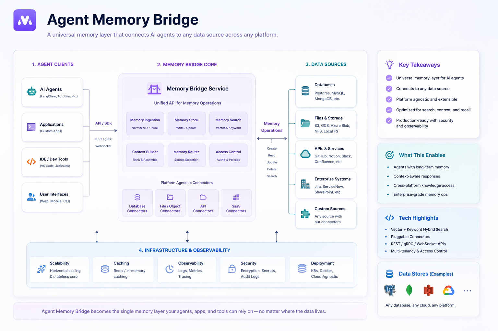

# diagram-studio

Diagram Studio is a Codex skill and Python renderer for planning, routing, and exporting polished software diagrams.

It does not assume one renderer is best for every diagram. The skill first decides the right abstraction and output mode, then routes to the backend that fits the job:

- **Presentation mode** for polished README, documentation, or deck visuals.
- **Editable mode** for deterministic SVG/HTML artifacts that can be inspected and iterated.
- **Portable mode** for Mermaid source that can move between documentation and diagram tools.
- **Concept UI mode** for product mockups where editor chrome is intentional.



## What is included

- `SKILL.md` with the Codex skill contract and routing rules.
- `diagram_studio/` with the structured SVG/HTML renderer and Mermaid exporter.
- `examples/` with JSON `DiagramSpec` fixtures.
- `references/` with routing, route-comparison, and presentation-quality notes.
- `assets/` with curated visual reference assets.

Generated render output is intentionally not committed. The default output directory is `generated/`, which is ignored by git.

## Install

```bash
python -m venv .venv
python -m pip install -e ".[dev]"
```

Activate the virtual environment first if you want to isolate dependencies. On Windows PowerShell, use `.\.venv\Scripts\Activate.ps1`. On macOS or Linux, use `source .venv/bin/activate`.

PNG export is optional because CairoSVG also requires native Cairo libraries. Install the optional Python dependency with:

```bash
python -m pip install -e ".[png]"
```

If PNG export still fails, install Cairo for your operating system. SVG, HTML, and Mermaid export do not require Cairo.

## Use The Renderer

Render one spec to SVG and HTML:

```bash
python -m diagram_studio.cli render examples/agent_memory_bridge.json
```

Render all bundled examples:

```bash
python -m diagram_studio.cli render-examples
```

Export Mermaid fallback files:

```bash
python -m diagram_studio.cli export-mermaid examples/agent_memory_bridge.json
```

Render PNG when Cairo is available:

```bash
python -m diagram_studio.cli render examples/agent_memory_bridge.json --png
```

## Use As A Codex Skill

Invoke the skill as `$diagram-studio` when you want Codex to turn a system description into a software diagram.

When installing this repository into a Codex skills directory, use a folder named `diagram-studio` so the folder matches the skill name in `SKILL.md`.

The skill should:

1. Understand the diagram intent.
2. Normalize the request into a `DiagramSpec`.
3. Choose presentation, editable, portable, or concept UI mode.
4. Route to the best backend.
5. Check density, hierarchy, text fit, and connector weight before export.

For implementation context, read `references/ROUTING_FIRST.md` first, then load the more specific reference file only when needed.

## Validate

Run the test suite:

```bash
python -m pytest
```

Run the skill metadata validator from the `skill-creator` skill when it is available:

```bash
python path/to/skill-creator/scripts/quick_validate.py .
```

The test suite covers:

- skill frontmatter and `agents/openai.yaml`
- example rendering to SVG/HTML without optional PNG dependencies
- Mermaid export
- presentation-mode defaults with no editor chrome
- unknown style error handling

## Repository Layout

```text
diagram-skills/
|-- SKILL.md
|-- README.md
|-- pyproject.toml
|-- agents/
|   `-- openai.yaml
|-- assets/
|   `-- agent-memory-bridge-reference.png
|-- diagram_studio/
|   |-- cli.py
|   |-- exporters.py
|   |-- icons.py
|   |-- renderer.py
|   `-- styles.py
|-- examples/
|-- references/
|-- scripts/
`-- tests/
```

## Design Direction

Diagram Studio is routing-first. Treat the built-in renderer as the deterministic/editable path, not the only hero path. Presentation-quality diagrams may route through an image model first, while the structured renderer and Mermaid exporter keep the workflow inspectable and portable.
